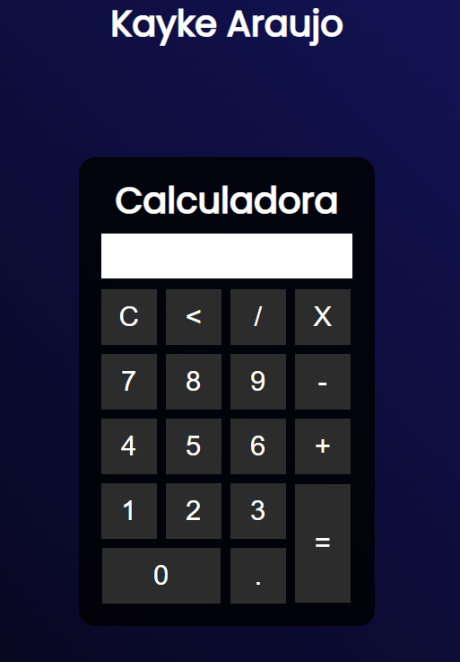

# 🧮 Calculadora Web Simples

Este projeto é uma **calculadora web** desenvolvida com **HTML5**, **CSS3** e **JavaScript puro**, com o objetivo de praticar os fundamentos do desenvolvimento front-end. Foi um dos meus primeiros projetos e serve como base para aprender estruturação de páginas, lógica de programação e manipulação do DOM.

---

## 📷 Demonstração



---

## 🚀 Tecnologias Utilizadas

- HTML5
- CSS3
- JavaScript (ES6+)

---

## ✨ Funcionalidades

- Inserção de números e operadores
- Cálculo de expressões matemáticas básicas
- Limpar resultado (C)
- Apagar último dígito (<)
- Exibição do resultado com o botão "="

---

## 📘 O que eu aprendi

- **Manipulação do DOM** com `getElementById` para exibir e atualizar o visor da calculadora.
- **Funções JavaScript** básicas (`insert`, `clean`, `back`, `calcular`) e organização do código em responsabilidades distintas.
- **Eventos inline em HTML**, utilizando `onclick` para acionar funções.
- **Estilização com CSS** e uso de gradientes, fontes externas (Google Fonts), bordas arredondadas e responsividade básica.
- **Lógica de programação**: controle de fluxo simples, uso de `eval()` para interpretar expressões e tratamento de entradas.

---

## 🗂️ Estrutura de Arquivos

```bash
📁 calculadora/
├── index.html         # Estrutura da interface
├── style.css          # Estilização visual da calculadora
├── javascript.js      # Lógica funcional da calculadora
└── README.md
```

---

## 📄 index.html

HTML que define a estrutura da interface da calculadora, incluindo a disposição dos botões e do visor.

---

## 🎨 style.css

Define o estilo da calculadora com um design moderno e responsivo. Utiliza gradientes, sombras e fontes externas (Poppins).

---

## 🧠 javascript.js

Contém a lógica da aplicação com as seguintes funções:

- `insert(num)`: Adiciona o número ou operador ao visor.
- `clean()`: Limpa o visor.
- `back()`: Remove o último caractere.
- `calcular()`: Executa a operação usando `eval()` e exibe o resultado.

---

## 🧑‍💻 Autor

Desenvolvido por **Kayke Araujo**.

[🔗 LinkedIn]([https://www.linkedin.com/in/](https://www.linkedin.com/in/kayke-araujo-guimar%C3%A3es-a27a20221/) • [📧 Email](mailto:araujokayke2006@gmail.com)
